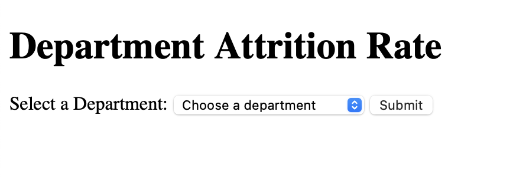
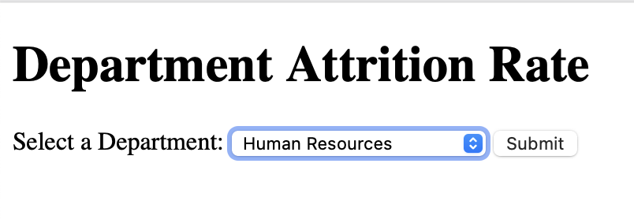
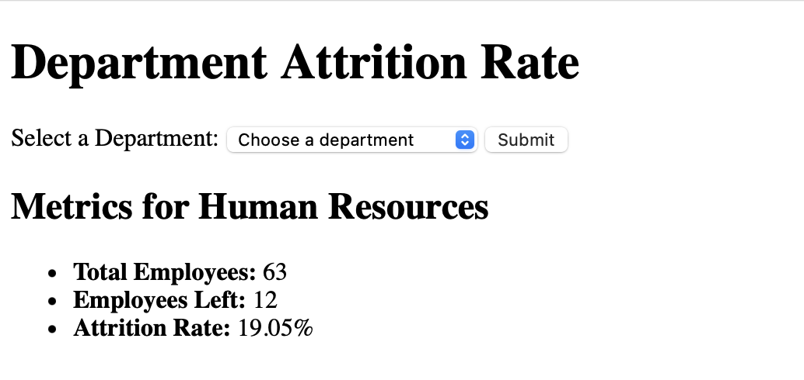
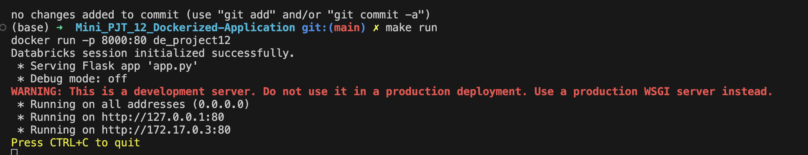

# IDS-706 Data Engineering Assignment
## Mini_PJT_11_Dockerized-Application

#### Status(CI/CD) badge 

---------
### Proejct Purpose

- This project involves creating a Dockerized application using a Python Flask app container. The objective is to demonstrate my operational Flask application within a Docker container (via Docker run terminal commands)and to build a Docker image in in my CI/CD pipeline, which will be pushed to Docker Hub

- This application includes an SQL database of an employees attrition dataset processed through an ETL pipeline in Databricks. Using the Flask app users can query departments via dropdown menus and receive attrition rate at department the level which is automatically calculated.

### Deliverables







----------
### Project Structure
```
Mini_PJT_12_Dockerized-Application
├─ .github
│  └─ workflows
│     └─ build.yml
├─ Dockerfile
├─ Makefile
├─ README.md
├─ app.py
├─ requirements.txt
└─ templates
   └─ index.html
```
----------
###  ***Operation***
1) Prepare configuration such as `Dockerfile`, `Makefile`, `requirements.txt`, and YAML for Github Actions.
2) Create an `app.py` file to implement Flas app code, which includes the Databricks API to connect required dataset and calculate the attrition rate upon user requests.
3) Containerize the Flask app using a `Dockerfile` and run it on a designated container port
4) configure `Makefile` to build a container from the Docker image, log in to Dockerhub (Docker id and password are required)
5) When running the container, a localhost URL is returened to test function in a browser

